# 1. Introduction

<br>
<p align="center">
    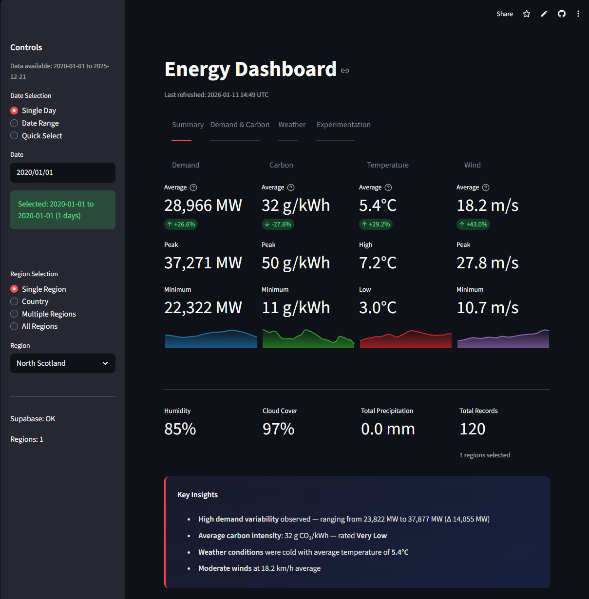
</p>
<br>

**Project Deployment:** [https://ukenergydashboard.streamlit.app](https://ukenergydashboard.streamlit.app) <br>
**Set-up Guide:** README.md <br>
**Assignment Brief:** documentation/assignment_brief.md <br>

---

## 1.1 Background & Motivation

UK systems are undergoing a serious structural reorganisation, moving away from non-renewable resources and towards net zero with increasing complexity for all electricity operations (Department for Business, Energy & Industrial Strategy, 2021). Changes to electricity consumption patterns have been witnessed because of this transformation. And since wind and solar energy production can only be managed by some non-human factors or other, that has made electricity generation abilities very variable indeed. Nevertheless, the UK surpassed 50.4% renewable electricity generation in the previous year (RenewableUK, 2024). 

Net zero may remain a work in progress, but empowering people with tools to investigate the issue can help raise awareness and understanding. On the other hand, many pieces of publicly available data are scattered across platforms and do not coalesce into one view capable of providing a holistic view of how individual variables interact. One example is the National Energy System Operator (NESO), which has many top-quality datasets and APIs for electricity demand, generation, and system operation (NESO, 2024). Yet these datasets are separately set up and published, leaving nontechnical audiences without an easy way to gain a look at how electricity demand, carbon intensity and generation mix are related.

<br> 
<p align="center"> 
     
</p> 
<br>

Therefore, for anyone intending to examine the interaction between electricity demand, carbon intensity, generation mix, and environmental factors, users will have to find either static summaries or perform significant preprocessing by themselves. This piece is inspired largely by the idea that data accessibility does not imply the ability to generate analytical insight, specifically in exploratory data analysis.

<br><br>

---

## 1.2 Problem Definition

The central problem addressed by this project is:

> How can multiple UK energy and environmental datasets be integrated into a single interactive system that allows intuitive exploration of energy and environmental patterns and trends? 

Although publicly available UK energy data continues to increase in availability (NESO, 2024), these sources remain fragmented and often exist at differing temporal resolutions, requiring substantial preprocessing and technical knowledge. This project aims to address this problem by providing an interactive dashboard that integrates electricity demand, carbon intensity, and weather data into a single system for exploratory analysis. The system also supports exploration of regions both in isolation and in combination.

<br><br>

---

## 1.3 Review of Existing Tools

### EnergyDashboard (energydashboard.co.uk)

EnergyDashboard provides a near real-time view of the UK electricity system with better visibility into its energy usage and the specific short-term operational aspects: demand, generation mix, actual activity, generation mix, and system status. The system's current state of play seems to be relatively useful to the general public, but the system is not rich and not so analytical as to be of interest to researchers or analysts.

<br>
<p align="center">
    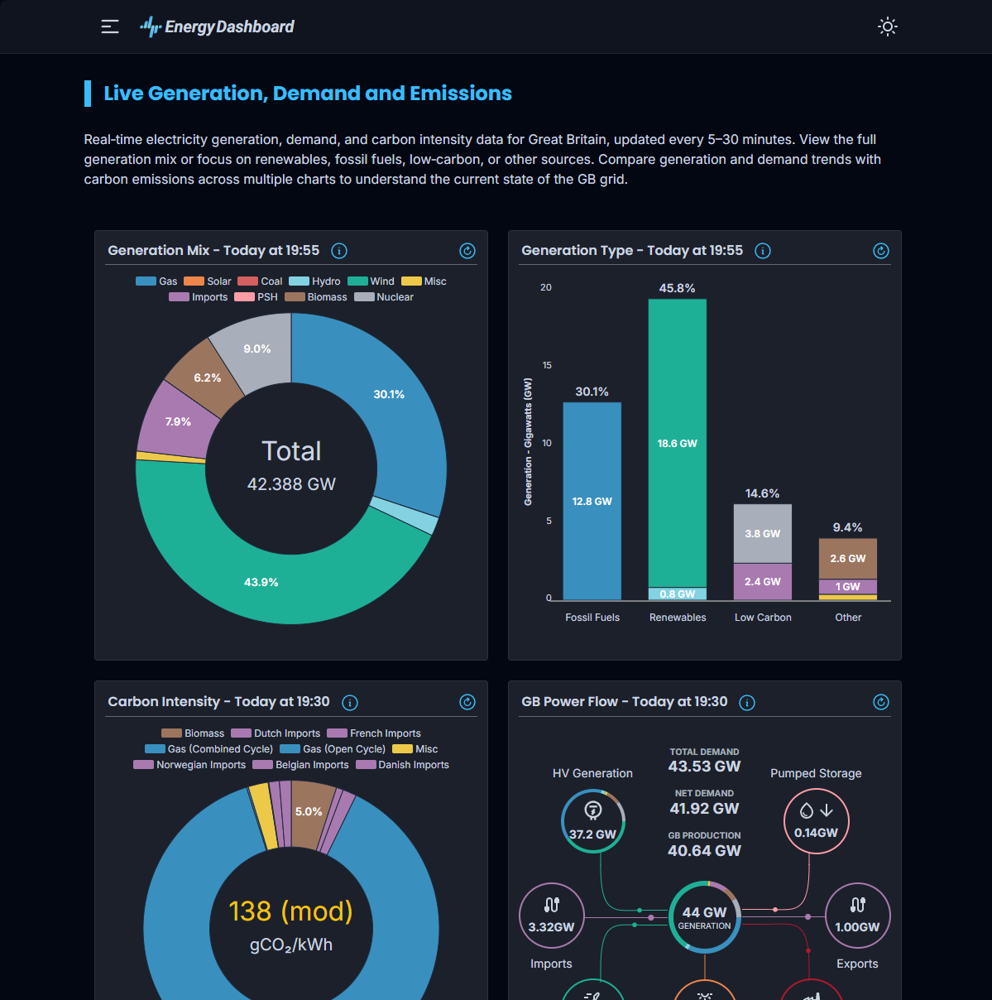
</p>
<br>

The dashboard is mostly operational rather than analytical, more for functions than anything analytical. Moreover, available historical data is restricted and only allows the user to see short-term or current system responses. There is very little custom filtering, cross-dataset comparison, and exploratory analysis by time and place. Accordingly, the platform serves well for monitoring operations in near real time but is missing a history of exploration.

---

### Great Britain’s Monthly Energy Statistics (NESO)

Data at NESO provide credible summaries of long-term trends within the UK energy system through the monthly statistics published there (NESO, 2024). Such reports summarize demand, generation, and system performance statistics into structured visualisations suitable for official reporting and retrospective analysis. But these projections are static and not easily up-to-date and do not allow for customized analysis.

<br>
<p align="center">
    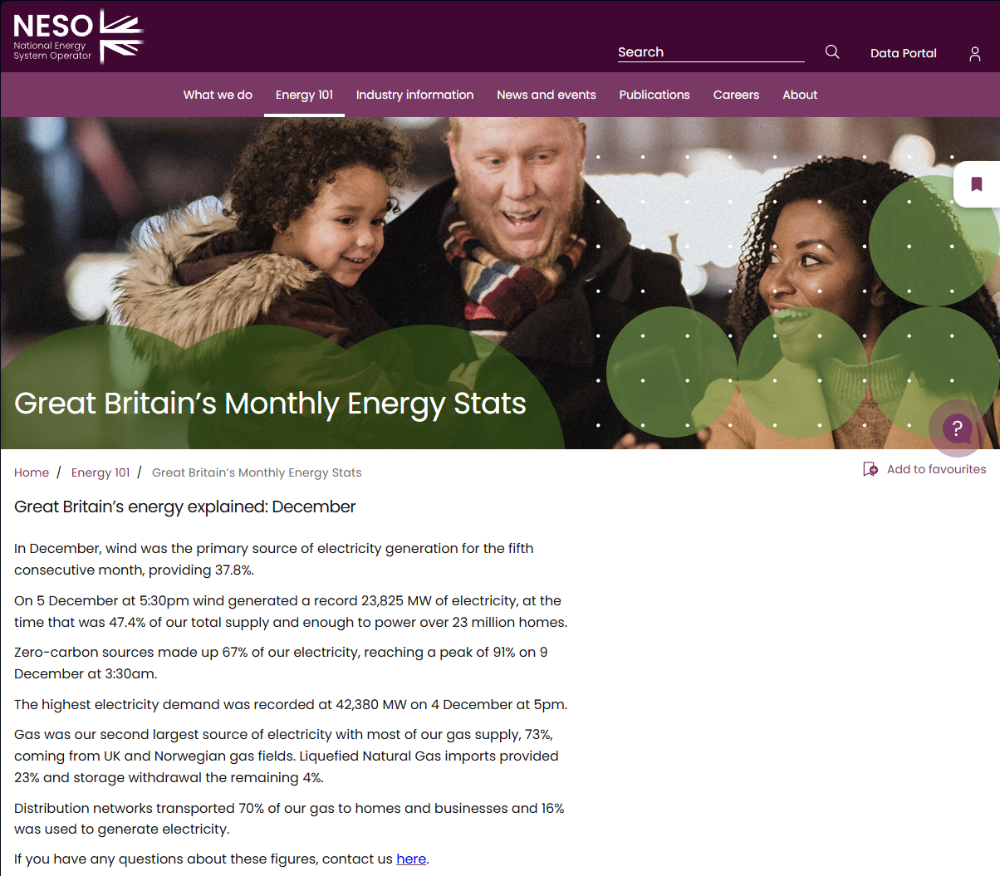
</p>
<br>

Although this helps to guarantee consistent and trustworthy insights, it restricts interactivity and narrow exploration into time-series phenomena. This limits the capacity of users to compute insights with the aid of specific regions and data, over the time windows, or with external data sources like weather data.

The main limitation across the two platforms is not on quality of the data but on the freedom of the user to interact with and the scale of data input into it. EnergyDashboard does best around operational data real time while NESO’s monthly statistics give historical depth for reliability, but not interactivity. The one platform does not combine multiple datasets in a single interaction system, which is meant for exploratory visualizations.

<br><br>

---

## 1.4 The Positioning of This Project
This project will be presented as an interactive and exploratory dashboard rather than a real-time monitoring or forecasting tool. Its main contributions are:

- Combined electricity demand, generation mix, power flow, carbon intensity, and weather data into a single platform
- Enable users to filter the data on region and selected time periods
- Facilitating pattern discovery with more powerful visualisations
- Offering system architecture for further development and expansion

Instead of competing with the existing platforms, this project aims to fill a gap by offering a free, open-source tool that enables users to engage directly with up-to-date UK energy data.

<br> <p align="center">  </p> <br>

<br>

## 1.5 Objectives & Scope

To fulfil the gaps identified in the analysis above, a set of core objectives and additional optional objectives are defined.

### Core Objectives

1. **Multi-source Data Integration**

   > Integrate electricity demand, generation mix, power flow, carbon intensity, and weather data into a single platform. Data should cover the period from 01/01/2020 to the latest available data point.

2. **Reliable Data Storage**

   > Store data in a remote relational database with clearly defined schemas and logic to rerun ingestion when new data becomes available.

3. **Interactive Time-Series Exploration**

   > Visualise data using time-series plots that support zooming, panning, and comparison of multiple variables within a single view.

4. **Regional and Temporal Exploration**

   > Allow users to filter data by region and date range, supporting both single and multiple region selection, as well as quick-select options such as the last 7, 30, or 90 days.

5. **Summary Statistics**

   > Provide summary statistics for the selected data, including metrics such as average, minimum, maximum, and trend, accompanied by a time-series plot for the selected period.

6. **Data-Driven Visualisations**

   > Use appropriate visualisations such as stacked bar charts, heatmaps, annotated geographical maps, diverging horizontal bar charts, and scatter plots to highlight patterns within the data.

---

### Additional Optional Objectives

7. **Deployment to Remote Hosting**

   > Deploy the dashboard to a cloud-based hosting platform for public access via a shareable URL, ensuring the deployed version mirrors local execution behaviour.

8. **Experimental Forecasting Tab**

   > Introduce an experimental section allowing users to select input features and targets to perform short-horizon forecasting using simple machine learning models, including regression and tree-based approaches.

9. **Visualisation of Experimental Results**

   > Present model performance metrics such as MAE, RMSE, and R². Visualise predicted versus true values and model performance over a 180-day window, and allow users to generate a 7-day future prediction.


<br><br>

# 2. Design

## 2.1 Design Goals & Limits

The UK Energy Dashboard design is informed by the requirement to provide an interactive interface for exploratory study of a cluster of related datasets to be run within a single platform and must be easy to reproduce, maintainable for further possibilities in future projects and add. Unlike other platforms that use operational monitoring systems or predictive analytics toolkits, we intend this system to enable users to analyze patterns, trends, or relationships across different regions and time frames.

In this regard, the restrictions below shape the design approach of this application:

- All the datasets are observational (missing data may exist if measuring instruments are unavailable).
- Varying temporal resolutions and update frequencies are present in the data types.
- Requirement of clean historical data (2020 onwards for Objective 1.5.1).
- Deployment requirement concurrent with local setups.

The limitations are what prompted a modular Streamlit application to implement a remote relational database that enables the
<br><br>

---

## 2.2 High-level System Architecture

We need to adopt a layered architecture which separates different functionalities such as data ingestion, data validation, database storage, application logic, and the UI. This separation allows us to isolate different functions more easily, which is quite useful in later maintenance.

<p align="center">  </p> <br> 

From a high-level perspective the system comprises the following components: 
- External data sources 
- Automated ingestion and validation layer 
- Reliable relational database 
- Data querying and state management on the application layer 
- Interactive dashboard UI

One consideration is that the dashboard be created within a relational database which eliminates the dependence on third party APIs, which are subject to rate limits and latency. Instead, one relies on a relational database (Supabase) to facilitate the development of all visualisations from validated data and using a consistent schema. It prevents a degradation of the overall user experience due to external APIs failing, or being unavailable.

The application relies on query-level caching along with a time-to-live (TTL) strategy in order to provide a better user experience. It minimises redundant database reads when visualizing different plots or changing tabs, increasing responsiveness and computational performance.

There is also consideration of pagination logic in terms of access to the data over long timescales. This enables query results to never be truncated for large historical ranges and prevents the Supabase client from exceeding any platform-supplied limits.

A background data update mechanism also allows new data to be imported when a new application is launched, keeping the data fresh. This process will be independent of the UI, enabling the user to interact with the application while refreshing the data. With the updated data the cached results are removed and the dashboard refreshes with the latest data.

All in all, this layout allows you to operate only on data with solid and consistent validation while remaining responsive. The above system-level architecture is depicted, showing how the data is input from various external sources and passed through validation and storage before being accessed using the interactive UI. <br><br>

---

## 2.3 Abstraction & Decomposition

To manage application complexity and simplify user interaction, abstraction and decomposition techniques are applied at the system level.

At the user level, abstraction ensures that interactions are limited to high-level analytical concepts such as time ranges, geographic regions, and energy metrics. Users are abstracted away from low-level implementation details such as database schemas and API-specific parameters. For example, when selecting a time range for a region, users do not construct SQL queries but instead interact with intuitive UI components. This allows non-technical users to explore the system without technical ability being a limiting factor.

<br>
<p align="center">
    
</p>
<br>

The figure above illustrates how low-level data handling is abstracted away from the UI.

At the application level, data access, preprocessing, and transformation are encapsulated within dedicated data loader components. This allows the application to receive data in a clean, structured format rather than raw API responses. As a result, changes to data source formats or storage schemas do not affect the UI or visualisations.

The overall problem of implementing the dashboard is further addressed through decomposition. The system is divided into distinct functional components, each serving a specific purpose. These components are grouped by shared functionality and organised into modules to improve maintainability and enable future extension. For example, a data module may include components for data access, validation, and ingestion.

Decomposition is also applied at the UI level, where visualisations are grouped by data domain rather than chart type. The dashboard separates views into sections for electricity demand, carbon intensity, and weather variables. This structure mirrors the underlying data decomposition and allows users to reason about each domain independently while maintaining a consistent interactive experience. It also reduces cognitive overload by allowing focused exploration of individual aspects of the energy system.

<br>
<p align="center">
    
</p>
<br>

The figure above demonstrates how the application is broken down into single-responsibility components to support easier testing and development.

Decomposition enables incremental development and testing of individual components, reducing the risk of cascading failures. It also allows new features to be introduced with minimal refactoring, as components operate in isolation with well-defined behaviour.

Together, abstraction and decomposition ensure that the system remains flexible and maintainable while supporting complex exploratory analysis through a clear and intuitive user interface.

 <br><br>

---

## 2.4 Data Design

This project uses a remote relational database to store large validated historical datasets while supporting interactive analysis at scale. A database-backed design was chosen instead of flat-file storage to ensure query performance and updateability.

The data used in this project is sourced primarily from two providers, each contributing differently to the overall richness of the UK energy system data.

Electricity demand and system-level operational data are sourced from the National Energy System Operator (NESO), the official body responsible for the UK electricity system. NESO also provides data for carbon intensity, generation mix, and power flows. The data is authoritative, consistently structured, and offers sufficient temporal resolution and historical depth. Although the data is aggregated at regional level, it is well suited to descriptive and comparative analysis of national energy demand.

Open-Meteo provides an open-source historical archive of weather and environmental variables, offering free hourly weather observations with broad geographic coverage. While regional weather data cannot capture local microclimates precisely, it is sufficient for investigating relationships between energy-related variables and environmental conditions.

### 2.4.1 Why Supabase?

Supabase was chosen as the storage platform for the following reasons:

* A PostgreSQL instance with ACID guarantees and indexing for efficient querying
* A remote setup suitable for deployment
* Simple Python integration via a client interface and API keys
* Support for adding new tables for future extension work

Supabase also provides a user-friendly API that simplifies data ingestion.

### 2.4.2 Schema Design

The schema is organised around the dimensions of time and region. The three main tables containing validated historical data are:

* `historic_demand` – energy demand and power flow data
* `carbon_intensity` – carbon intensity and generation mix data
* `weather` – weather data

The following SQL definitions are used to create the tables and indexes for efficient querying. These queries can be executed in the Supabase SQL editor to reproduce results locally.

#### `weather` table

```sql
CREATE TABLE weather (
    id BIGSERIAL PRIMARY KEY,
    datetime TIMESTAMP NOT NULL,
    region_id INTEGER NOT NULL,
    region_name TEXT NOT NULL,
    temperature REAL,
    humidity REAL,
    wind_speed REAL,
    cloud_cover REAL,
    precipitation REAL,
    UNIQUE(datetime, region_id)
);

CREATE INDEX idx_weather_datetime ON weather(datetime);
CREATE INDEX idx_weather_region ON weather(region_id);
```

#### `carbon_intensity` table

```sql
CREATE TABLE carbon_intensity (
    id BIGSERIAL PRIMARY KEY,
    datetime TIMESTAMPTZ NOT NULL,
    region_id INTEGER NOT NULL,
    region_name TEXT,
    forecast INTEGER,
    index TEXT,
    gen_biomass DECIMAL,
    gen_coal DECIMAL,
    gen_imports DECIMAL,
    gen_gas DECIMAL,
    gen_nuclear DECIMAL,
    gen_other DECIMAL,
    gen_hydro DECIMAL,
    gen_solar DECIMAL,
    gen_wind DECIMAL,
    created_at TIMESTAMPTZ DEFAULT NOW()
);

CREATE INDEX idx_carbon_intensity_datetime ON carbon_intensity(datetime);
CREATE INDEX idx_carbon_intensity_region ON carbon_intensity(region_id);
CREATE UNIQUE INDEX idx_carbon_intensity_datetime_region ON carbon_intensity(datetime, region_id);
```

#### `historic_demand` table

```sql
CREATE TABLE historic_demand (
    id BIGSERIAL PRIMARY KEY,
    datetime TIMESTAMPTZ NOT NULL UNIQUE,
    nd DOUBLE PRECISION,
    tsd DOUBLE PRECISION,
    england_wales_demand DOUBLE PRECISION,
    embedded_wind_generation DOUBLE PRECISION,
    embedded_wind_capacity DOUBLE PRECISION,
    embedded_solar_generation DOUBLE PRECISION,
    embedded_solar_capacity DOUBLE PRECISION,
    non_bm_stor DOUBLE PRECISION,
    pump_storage_pumping DOUBLE PRECISION,
    scottish_transfer DOUBLE PRECISION,
    ifa_flow DOUBLE PRECISION,
    ifa2_flow DOUBLE PRECISION,
    britned_flow DOUBLE PRECISION,
    moyle_flow DOUBLE PRECISION,
    east_west_flow DOUBLE PRECISION,
    nemo_flow DOUBLE PRECISION,
    nsl_flow DOUBLE PRECISION,
    eleclink_flow DOUBLE PRECISION,
    viking_flow DOUBLE PRECISION,
    greenlink_flow DOUBLE PRECISION,
    created_at TIMESTAMPTZ DEFAULT NOW()
);

CREATE INDEX idx_historic_demand_datetime ON historic_demand(datetime);
```

### 2.4.3 Data Cleaning

Given that the datasets used in this project originate from multiple sources with differing structures and temporal resolutions, data must be standardised before being stored in the relational database. This requires a well-defined cleaning stage that can be consistently applied to both historical and newly ingested data.

<br>
<p align="center">
    
</p>
<br>

The first cleaning step involves timestamp normalisation. Some external providers supply timestamps that are not timezone-aware, making normalisation essential for correct temporal alignment.

The second step standardises data schemas to ensure all fields align with the database design. For example, demand data is provided using `SETTLEMENT_DATE` and `SETTLEMENT_PERIOD` fields, which must be converted into a timezone-aware timestamp before insertion.

The next step handles duplicate records. Composite keys (`datetime`, `region_id`) or primary keys (`datetime`) are used to enforce uniqueness. Supabase upsert functionality provides an additional safeguard by ignoring duplicate records during ingestion.

Missing data is handled conservatively. Rather than removing records with missing fields, all records are retained to reflect the observational nature of the datasets. Filtering of missing values is performed at the client level, preserving opportunities for future investigation.

The final step applies sanity and range checks to detect implausible values, such as negative demand or unrealistic temperature readings. Records failing these checks are excluded from the database to ensure that only validated data is used in the dashboard.

Collectively, these steps ensure that the datasets are consistent and suitable for exploratory analysis.

### 2.4.4 Data Quality

To assess data quality and ensure compliance with the standards described above, a dedicated notebook (`notebooks/data_analysis.ipynb`) was used. This notebook also supports bulk loading of data into a separate database instance for local experimentation.

The first quality check assessed temporal completeness by comparing expected and observed timestamps.
<br>

| Dataset          | Expected Coverage     | Observed Coverage | Time Gaps Detected | Action Taken          |
| ---------------- | --------------------- | ----------------- | ------------------ | --------------------- |
| Historic Demand  | 2020–present (hourly) | 2020–present      | No                 | Accepted              |
| Carbon Intensity | 2020–present (hourly) | 2020–present      | Minor gaps         | Accepted & documented |
| Weather          | 2020–present (hourly) | 2020–present      | No                 | Accepted              |

<br>
The second quality check verified that no duplicate records were present.
<br>

| Dataset          | Key Used             | Duplicates Found | Resolution Strategy     |
| ---------------- | -------------------- | ---------------- | ----------------------- |
| Historic Demand  | datetime             | No               | No action required      |
| Carbon Intensity | datetime + region_id | Yes (2,982)      | Deduplicated / upserted |
| Weather          | datetime + region_id | No               | No action required      |

<br>
The third quality check analysed missing values across datasets.
<br>

| Dataset          | Fields Affected            | Missing Values Present | Handling Strategy        |
| ---------------- | -------------------------- | ---------------------- | ------------------------ |
| Historic Demand  | Minor operational fields   | Yes (low proportion)   | Retained, visually shown |
| Carbon Intensity | Generation mix fields      | Yes                    | Retained, documented     |
| Weather          | Precipitation, cloud cover | Yes                    | Retained, no imputation  |

<br>
The final quality check applied sanity and range validation.
<br>

| Dataset          | Check Performed         | Issues Detected | Action Taken |
| ---------------- | ----------------------- | --------------- | ------------ |
| Historic Demand  | Non-negative demand     | No              | Accepted     |
| Carbon Intensity | Non-negative generation | Rare anomalies  | Excluded     |
| Weather          | Physical plausibility   | No              | Accepted     |

<br>
---
<br><br>

## 2.5 Design Trade-offs

The design of the UK Energy Dashboard involved a series of deliberate decisions to balance exploratory capability, system complexity, and performance while remaining within project scope. Rather than maximising technical complexity or feature count, the focus was on enabling reliable exploratory analysis.

A lightweight Python-based framework, Streamlit, was selected for the dashboard. Streamlit provides strong support for cloud deployment through Streamlit Community Cloud and is straightforward to run locally using `pip`. However, it abstracts away fine-grained frontend customisation available in other frameworks. This was considered an acceptable trade-off given the analytical rather than presentation-driven goals of the project.

As the project is deployed, a remote relational database was chosen over flat-file storage. While this introduces additional setup complexity, it enables efficient querying, indexing, and consistent access across both local and deployed environments.

All analysis is performed at national or regional level. This limits geographical granularity but aligns with the availability of public data and the scope of the project.

<br><br>

# 3. Methodolgies 

## 3.1 Metholdogical Positionaing 

In this project we are introducing a methodology model on an interactive Exploratory Data Analysis (EDA) level. The dashboard should not generate static summaries or static plots; it is built to dynamically investigate energy demand, environmental, and geographical data. These visualisations aim to minimize the cognitive load on the end user, but also get as much insight from it, by generating complex visualisations that simplify temporal, geographic, and compressed patterns, which are often far more difficult to see in a simple time series or scatter plot.
<br><br>

## 3.2 Summary tab 

The Summary tab provides a high level view of all the data in an aggregated manner and acts as the entry point for the user. As shown below the Summary dashboard contains the main statistics with contextual visaul indicators 

<br>
<p align="center">
    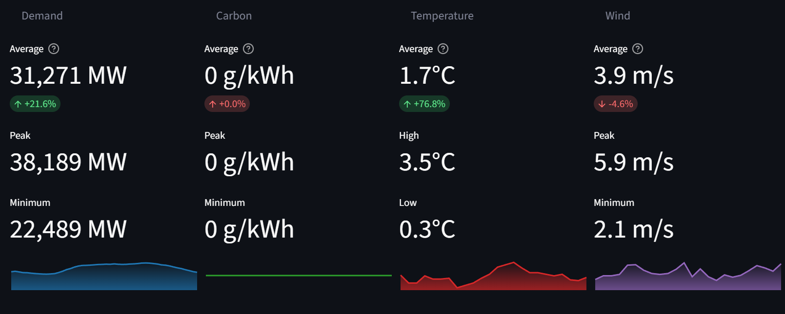
</p>
<br>

To quantify overall directional change within the selected time window, a simple trend metric is computed by splitting the time series into two equal halves and comparing their mean values. Formally, let $( {x_1, x_2, \dots, x_n} )$ denote the observed values over the selected period, where $( n )$ is even. The trend is defined as:

$$
\text{Trend} = \frac{\bar{x}_{\text{second}} - \bar{x}_{\text{first}}}{\bar{x}_{\text{first}}} \times 100
$$

where:

$$
\bar{x}_{\text{first}} = \frac{1}{n/2} \sum_{i=1}^{n/2} x_i
$$

$$
\bar{x}_{\text{second}} = \frac{1}{n/2} \sum_{i=n/2+1}^{n} x_i
$$

Additioanlay using some conditional logic the user gets acess to some insights into the charectistics of the data. This includes insights suchas the variabilty of the data, cleanset region & highest carbon region, weather conditions and wind conditions in a descriptive manner.

<br>
<p align="center">
    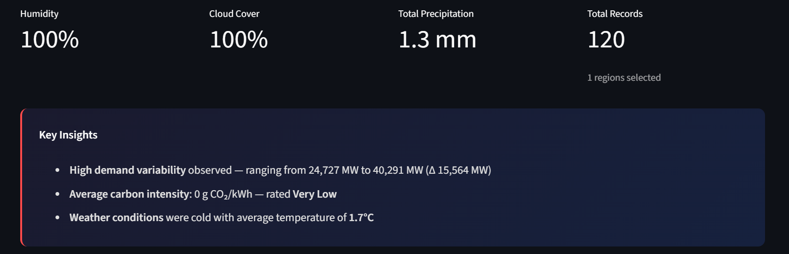
</p>
<br>

There is also a Time series chart to give the users an overview of how the variable interaction is like, the key variables plots together. It enables you to understand how different variables may be associated. The variables have been normalised so that the 4 variables all have a range of 0-100 in order to clearly observe the relation of variables to each other and without blown-out timeseries appearing in big quantities. The min max normalisation was implemented in the following way:


$$
x_{\text{norm}} = \frac{x - x_{\min}}{x_{\max} - x_{\min}} \times 100
$$

where: 

$$
x_{\min} = \min(x_1, x_2, \dots, x_n)
$$

$$
x_{\max} = \max(x_1, x_2, \dots, x_n)
$$


- $x$ is the observed value,
- $x_{\min}$ and $x_{\max}$ are computed over the selected time range,
- $x_{\text{norm}} \in [0, 100]$.

<br>
<p align="center">
    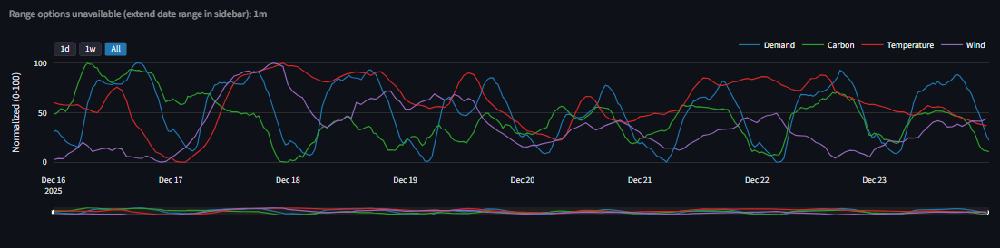
</p>
<br>

<br>

## 3.3 Energy & Carbon Intensity tab

The Energy & Carbon tab supports detailed exploration of electricty demand, carbon intensity, genration mix and power flow. This tab integrates multiple visulisations each chosen to highlight a specefic structural aspect of the system 

<br>
<p align="center">
    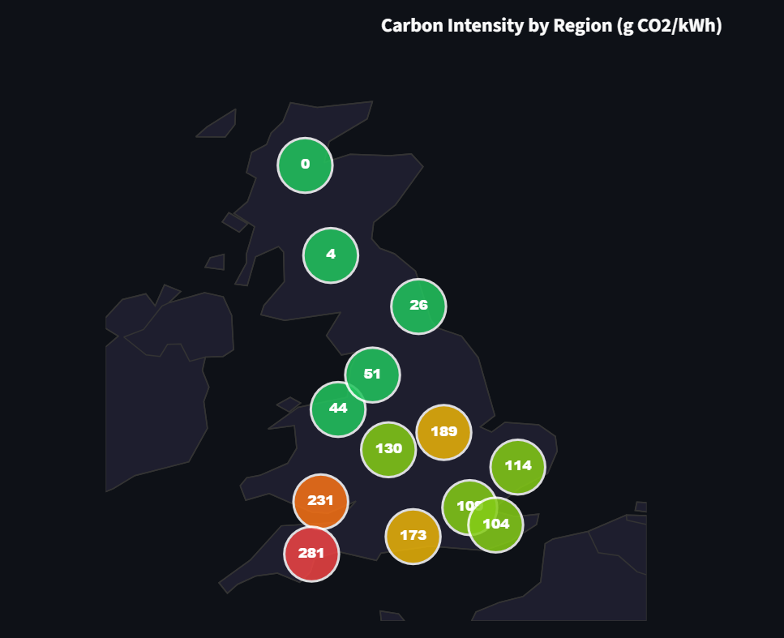
</p>
<br>


Geographical choropleth maps as shown here are tools for visualizing carbon intensity data. In this situation, maps are much preferred because the user is able to visualize the spatial dimensions of the data possible if they choose to use them. For instance, responses to questions such as are southern regions more polluted than northern regions? etc. This enables you to identify clusters of patterns and outliers.

<br>
<p align="center">
    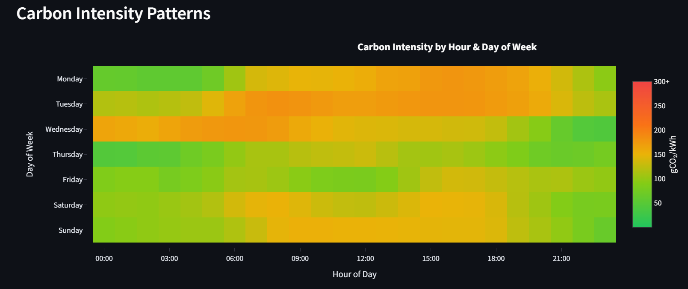
</p>
<br>

Heatmaps are great to show temporal intensity over a 7 day period. The data magnitude can be presented by means of colour, in contrast to either size or position. This is preferable over large time series because the former takes the entire data and condenses it into one view: this allows distinguishing periodic patterns. This enables the user to assess short-term trends and long-term trends by pressing the date range.
<br>
<p align="center">
    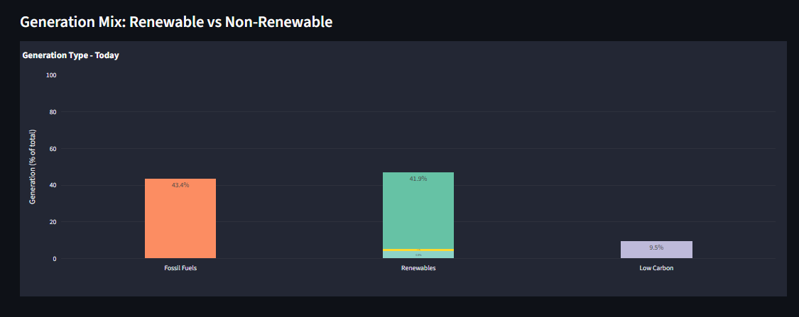
</p>
<br>

Stacked bar charts represent generation mix compositions grouped by low carbon, fossil fuels, and renewable types of energy. This enables the user to compare the proportional differences between renewable and non-renewable sources in a single visual frame. It would be less effective to split this into 2 plots, one for each type of energy source.

<br>
<p align="center">
    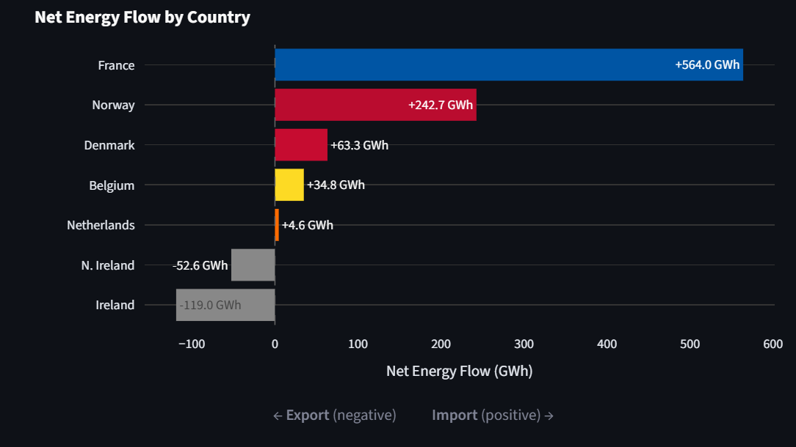
</p>
<br>

The net energy flow by country is shown on diverging horizontal bar charts. A zero line in this diagram puts the focus on balance and magnitude at the same time. Other formats, such as grouped bar charts, would obscure this directional data. This visualisation allows for multi-dimensional exploration by combining temporal, regional, and structural views via a single interface.

<br><br>

## 3.4 Weather tab

The Weather tab introduces environmental variables to provide some context into why the energy systme may be beahving in a certain way. Time-series plots are used to visualise temperature, wind speed, precipitation, and cloud cover over a selected period of time.

<br>
<p align="center">
    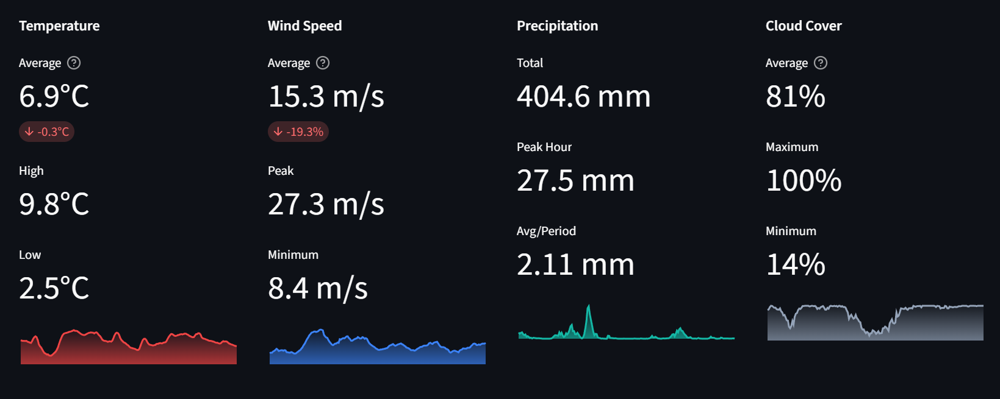
</p>
<br>

Heatmaps for an example are excellent for showing temporal intensity over a 7-day interval. The overall weight of the data is converted into colour, neither the position nor the size of the chart. This is preferable compared to conventional time series, since it bundles the data together in one view and enables recognition of periodic processes. It allows the user to assess short term and long term trends by toggling the date range. Here a heatmap can be used and also for plotting heatmaps for various variables, this helps to explore the data even more

<br>
<p align="center">
    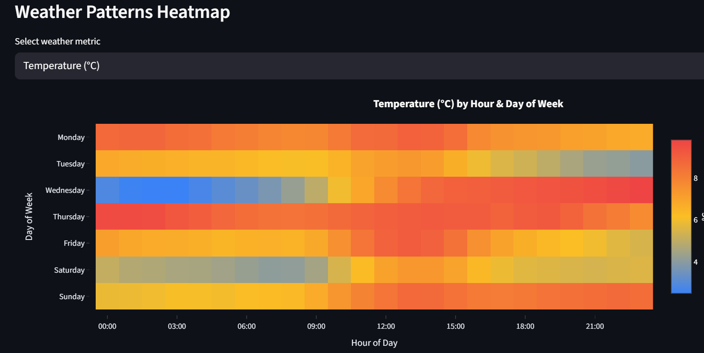
</p>
<br>

Scatter plots are used to explore potential relationships between weather variables and energy demand. This choice allows users to visually assess linearity & clustering without the need for statistical models. It gives flexibility because the focus of the application is to explore relationships with different variables and the scatter plot allows for the maximum flexibility by giving users the option to select any 2 variables to see how they may relate, enabling the initial problem statement in the introduction.

<br>
<p align="center">
    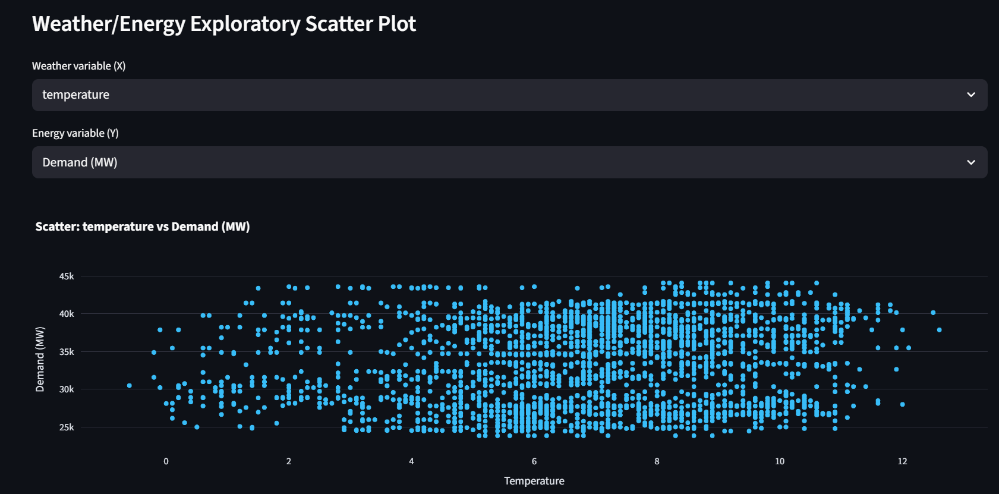
</p>
<br>
<br>

## 3.5 Experimentational tab 

The Experimentation tab provides and environment for the user to experiment and apply simple quantative models to the available data. This section is seperated to diffrentiate between exploratory modelling and analysis.  

### 3.5.1 Linear Regression

<br>
<p align="center">
    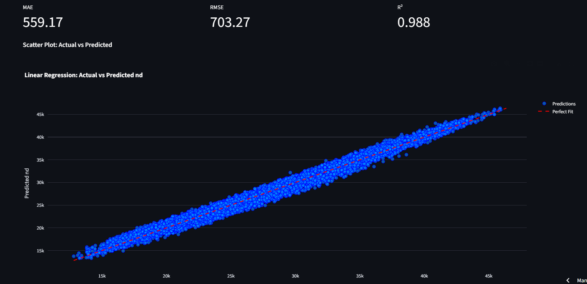
</p>
<br>

Linear regression is implemented as an experimental analytical tool to explore linear dependence between a target variable and one explanatory variable. The model is defined as:

$$
y = \beta_0 + \beta_1 x + \varepsilon
$$

where:
- $y$ is the dependent variable (e.g. electricity demand or carbon intensity),
- $x$ is the explanatory variable,
- $\beta_0$ is the intercept,
- $\beta_1$ is the slope coefficient,
- $\varepsilon$ is a random error term.

Model parameters are estimated using ordinary least squares (OLS), which minimises the sum of squared residuals:

$$
\min_{\beta_0, \beta_1} \sum_{i=1}^{n} (y_i - \hat{y}_i)^2
$$

Regression outputs are evaluated using standard error metrics.

**Mean Absolute Error (MAE):**

$$
\text{MAE} = \frac{1}{n} \sum_{i=1}^{n} \lvert y_i - \hat{y}_i \rvert
$$

**Root Mean Squared Error (RMSE):**

$$
\text{RMSE} = \sqrt{\frac{1}{n} \sum_{i=1}^{n} (y_i - \hat{y}_i)^2}
$$

These metrics are selected because they provide intuitive measures of the average deviation between predicted and observed values. The Regression results are visualised using predicted vs actual plots, allowing users to assess the goodness of the model. Due to the aggregated and observational nature of the data, regression outputs are treated as exploratory indicators rather than predictive models.

### 3.5.2 Correlation Analysis

<br>
<p align="center">
    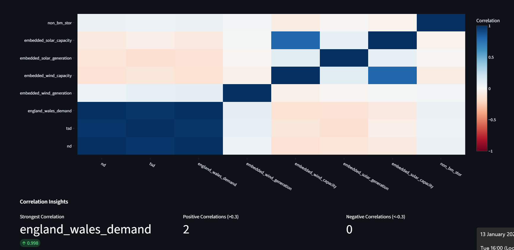
    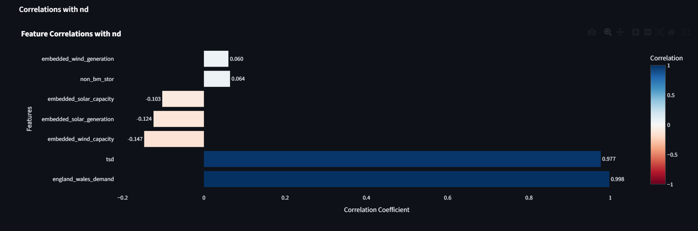
</p>
<br>

Correlation is a numerical measurement technique to determine the magnitude and direction of linear relations between pairs of variables (electricity demand, carbon intensity, generation variables, storage variables). That analysis aids in exploratory research as a numerical summary serves to augment the visual inspection at first glance and aids in prioritizing variables for further investigation. The dashboard operates with Pearson’s correlation coefficient, defined as:

$$ r = \frac{\sum_{i=1}^{n} (x_i - \bar{x})(y_i - \bar{y})} {\sqrt{\sum_{i=1}^{n} (x_i - \bar{x})^2}\sqrt{\sum_{i=1}^{n} (y_i - \bar{y})^2}} $$

where:

- $x_i$ and $y_i$ are paired observations,
- $\bar{x}$ and $\bar{y}$ are sample means,
- $n$ is the number of observations.

The coefficient assumes coefficients that fall within the interval $[-1, 1]$, such that values near $+1$ represent a strong positive linear association, values near $-1$ a strong negative association, and values near 0 a weak or no linear association.

Correlation scores are determined by the timescale selected by the user, along with the location (region of interest) to grant access to temporal context. We highlight that these values are simply descriptive associations rather than proof of association from a causal perspective. We present a correlation heatmap showing the global pairwise relationships between a subsample of the variables we wish to examine in parallel. Colour intensity indicates the scale and direction of association—it helps users efficiently identify clusters of closely connected variables and redundant features in that set. This representation above has opted for a scale with more variables than a large number of pairwise scatter plots, in order to represent rapid pattern detection. This heatmap can be applied to analyse the data: it permits exploring the structure that needs more in-depth exploration including plots or models at best, and only then, that which provides a high degree of accuracy.

To bring the focus and attention of analysis by comparing one particular target variable (e.g., national demand) with all other variables a ranked horizontal bar chart is created. This visualisation provides summaries of correlation degree on a single axis which can help in comparing the strength and the direction of the relations. A ranked-based format instead of tabulated summary so as to have ranking and contrast and the user can easily locate the most relevant positive and negative factors.


### 3.5.3 Random Forest Tree 

<br>
<p align="center">
    
</p>
<br>

A Random Forest model consists of an ensemble of $T$ decision trees, each trained on a bootstrapped subset of the data and a random subset of input features. The prediction of the Random Forest regressor is given by:

$$
\hat{y}(x) = \frac{1}{T} \sum_{t=1}^{T} f_t(x)
$$

where:
- $T$ is the number of trees in the forest,
- $f_t(x)$ is the prediction of the $t$-th decision tree for input vector $x$.

Each decision tree recursively partitions the feature space by selecting split points that minimise a node impurity measure. For regression tasks, the impurity at a node is measured using mean squared error (MSE):

$$
\text{MSE} = \frac{1}{n} \sum_{i=1}^{n} (y_i - \bar{y})^2
$$

where:
- $y_i$ are the observed target values within the node,
- $\bar{y}$ is the mean target value of the node,
- $n$ is the number of samples reaching the node.

At each split, the algorithm selects the feature and threshold that result in the greatest reduction in MSE across the child nodes.


To reduce variance and improve generalisation, each tree is trained on a bootstrapped sample of the training data. Additionally, at each split, only a random subset of features is considered. This decorrelates individual trees and improves ensemble robustness.


Random Forest predictions are evaluated using the same error metrics as linear regression to allow direct comparison:

**Mean Absolute Error (MAE):**

$$
\text{MAE} = \frac{1}{n} \sum_{i=1}^{n} \lvert y_i - \hat{y}_i \rvert
$$

**Root Mean Squared Error (RMSE):**

$$
\text{RMSE} = \sqrt{\frac{1}{n} \sum_{i=1}^{n} (y_i - \hat{y}_i)^2}
$$

Following Random Forest algorithm implementation, the dashboard shows a simple set of outputs which includes model metrics and a ranked feature importance table. These outputs are supplemented with transparent commentary on the model behaviour, and users can also make sense of how different feature choices and time windows influence the model. The error measures (MAE and RMSE) are demonstrated to measure the prediction error in the same units as the target variable, and the coefficient of determination (R²) offers a normalized measure of explanatory power for cross-experiment comparisons. Feature importance rankings are given to show the relative influence of input variables on the model’s decisions, which can support interpretability without visualizing individual decision trees. Together, these representations are intended to facilitate exploratory experimentation and to enable model behaviour to be seen as observable and comparable, not as a black-box predictor.

<br><br>


## 3.6 Limitations 

This project has purposefully chosen some analytical methods to allow exploratory analysis, and these have methodological limitations which are to be accepted. 

First, correlation analysis only gives the correlation between variables that is linearly proportional to each other; which does not capture the non-linear and directional effects of the analysis. Correlation analysis is also time and place dependent and so differences in observed associations depend greatly on user defined filters. Consequently, our correlations are descriptive, and not evidence of causality. 

Second, linear regression assumes a linear relationship between variables, constant variance of errors, and independent observations. The assumptions likely do not apply properly for the energy time-series data as it has a clear temporal autocorrelation and seasonal structure. As a result, regression results are present only for exploratory consideration rather than for statistical inference. 

Third, Random Forest models can fit non-linear relationships; but, they can overfit when dealing with highly autocorrelated time-series data, such as when lagged variables are also included. Model complexity is limited, but key performance measures are based on in-sample fit rather than generalisation capability. In addition, Random Forests have less interpretability than parametric models despite the inclusion of feature importance metrics. 

Lastly, normalisation and aggregation decisions prepared in the context of visualisation could have implications on the results of analysis. Although they are required for exploratory comparison, these transformations can hide absolute magnitudes as well as local variation, suggesting that careful interpretation is imperative in addition to raw value plots.
<br><br>

# 4. Evaluation 

## 4.1 Evaluation Overview 

This section evaluates the UK Energy & Sustainability Dashboard against the core and optional objectives defined in Section 1.5. Functional completeness, analytical usefulness, performance, usability, and methodological appropriateness are evaluated. These include evidence from the implemented dashboard features, system behaviour under interaction, and analytical outputs produced across different tabs. The evaluation focuses on whether the system fulfils its intended role as an interactive exploratory analysis platform, rather than as an operational monitoring or forecasting system.

<br><br>

## 4.2 Core Objectives Evaluation

### Objective 1: Multi-source Data Integration

> The objective was to bring together electricity demand, carbon intensity, generation mix, power flow, and weather data on a single analytical platform from 01/01/2020 onwards. 

This goal was successfully accomplished. Data from NESO and Open-Meteo are ingested, cleaned, and stored within a unified relational schema. The user dashboard enables them to view and compare the datasets at once via aligned time-series, maps, and comparative plots. The capability to filter for region and time range shows the effective integration across datasets having different temporal resolutions.

### Objective 2: Reliable Data Storage

>The system required a remote relational database with clearly defined schemas and support for repeated ingestion.

The goal was successfully met using Supabase as a PostgreSQL-backed storage layer. The schemas make sure that there is consistency throughout by implementing primary keys, composite uniqueness constraints, and indexing. The ingestion logic also supports idempotent updates, which allows historical data to be updated without duplicating it. The design helps reliable local and deployed execution environments


### Objective 3: Interactive Time-series Exploration

>The dashboard was required to support zooming, panning, and multi-variable comparison within time-series plots.

This objective was achieved. In interactive time-series plots, users can sample the trend at different temporal resolutions. The Summary tab also supports min–max normalised multi-variable overlays, with an option for comparative pattern analysis between heterogeneous variables without being affected by scale. This directly enables exploratory analysis.


### Objective 4: Regional and Temporal Exploration

>The dashboard was required to support zooming, panning, and multi-variable comparison within time-series plots.

<br>
<p align="center">
    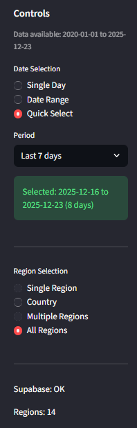

</p>
<br>

This objective was successfully achieved. On the dashboard is single-region or multi-region selection, custom date ranges, and predefined windows (like last 7, 30, or 90 days). Changes propagate dynamically across visualisations, which provides rapid comparative exploration across regions and time periods


### Objective 5: Summary Statistics

>The system required high-level summary metrics contextualised by visual trends.

We accomplished this goal by displaying average, minimum, maximum, and trend indicators via the Summary tab, as well as additional visualisations. This analysis builds on baseline-relative comparison and yields directional metrics without linear assumptions. This seeks interpretability while ensuring analytical robustness.

### Objective 6: Data-driven Visualisations

>The dashboard was required to employ appropriate visualisations for different data types.

That was achieved in its entirety. The system makes use of time-series plots, choropleth maps, stacked bar charts, heatmaps, diverging bar charts, and scatter plots. Each visualisation is chosen based on the analytical task it supports allowing users to examine temporal, spatial, and structural aspects of the UK energy system.

<br><br>

## 4.3 Optional Objectives Evaluation

### Objective 7: Deployment to Remote Hosting

> The system was required to be deployes on remote hosting 

This optional objective was fully achieved. The dashboard was successfully deployed to Streamlit Community Cloud and remains publicly accessible. The deployed version mirrors local execution behaviour, validating the reproducibility of the system design.

### Objective 8: Experimental Forecasting Tab

> An experimental tab was implemented allowing users to apply linear regression and Random Forest models to selected variables.

This aim was somewhat realized in design. The models work well and offer interpretable outputs but are artificially limited, and presented as exploratory. The absence of formal validation or uncertainty modelling is a deliberate methodological choice rather than an artifact of partial implementation.


### Objective 9: Visualisation of Experimental Results
> Model performance metrics and feature importance outputs are presented clearly following model execution

This objective was partially achieved. The inclusion of MAE, RMSE, R², and feature importance tables allows users to compare experiments and reason about model behaviour, supporting transparent exploration rather than black-box prediction. Although the metrics were implemented the plots of predection vs results was not implemented

<br><br>

## 4.4 Perfomance & Usability 

## 4.5 Reflection & Future Improvement

## References

Department for Business, Energy & Industrial Strategy (2021) *Net Zero Strategy: Build Back Greener*. Available at: [https://assets.publishing.service.gov.uk/media/6194dfa4d3bf7f0555071b1b/net-zero-strategy-beis.pdf](https://assets.publishing.service.gov.uk/media/6194dfa4d3bf7f0555071b1b/net-zero-strategy-beis.pdf) 

RenewableUK (2024) *Energy Bible confirms renewables now provide over half of the UK’s electricity generation*. Available at: [https://www.renewableuk.com/news-and-resources/press-releases/energy-bible-confirms-renewables-now-provide-over-half-of-the-uk-s-electricity-generation/](https://www.renewableuk.com/news-and-resources/press-releases/energy-bible-confirms-renewables-now-provide-over-half-of-the-uk-s-electricity-generation/)

National Energy System Operator (NESO) (2024) *NESO Data and Energy Information*. Available at: [https://www.neso.energy](https://www.neso.energy) 


